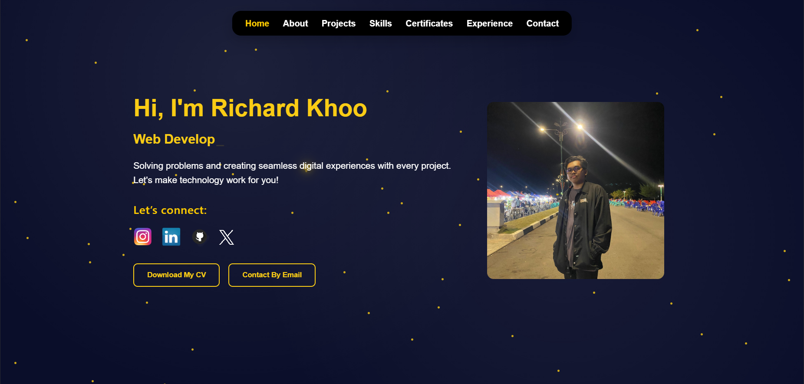
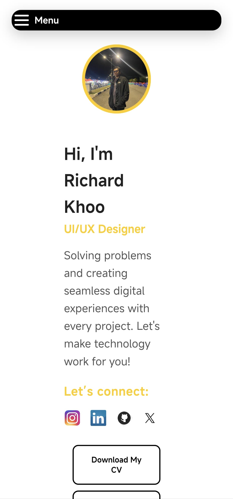

# 💼 Richard Khoo - Portofolio Website

A personal portfolio website built with **React**, designed to showcase my projects, skills, certifications, and experiences in a sleek and modern layout.



---

## 🚀 Live Demo

🔗 [richard-khoo.vercel.app](https://richard-khoo.vercel.app)

---

## ✨ Features

- 🎯 Smooth scroll & animated transitions  
- 📱 Responsive design (Mobile-first)  
- 🌠 Full-page animated background with falling stars and glowing dots  
- 🛠️ Built using React + Vite  
- 🌙 Elegant dark theme  
- 📜 Downloadable CV  
- 🖼️ Interactive project cards  
- 🧾 Certificate showcase  
- 📆 Dynamic timeline animation using IntersectionObserver  
- 🔗 Social media integration  

---

## 🧰 Tech Stack

- **Frontend:** React, HTML5, CSS3  
- **Animations:** Framer Motion, IntersectionObserver  
- **Deployment:** Vercel  
- **Design:** Custom CSS (no UI framework)  

---

## 📂 Sections Included

- **Home**  
- **About Me**  
- **Projects**  
- **Skills**  
- **Certificates**  
- **Experience**  
- **Contact**

---

## 🛠️ Custom Improvements

- 📌 **Timeline Alignment:** Alternating layout for experience cards with years positioned on the opposite side of the content.  
- 🎨 **Responsive Timeline Enhancements:** Mobile-friendly version with hidden icons, simplified layout, and styled inline dates.  
- 🌌 **Animated Starry Background:** Custom CSS background with twinkling stars and glowing particles.  
- 📱 **Mobile Optimization:** Improved spacing, alignment, and visibility control using media queries.  
- ✨ **IntersectionObserver:** Fade-in animation when experience items scroll into view.

---

## 🖼️ Screenshots

| Desktop | Mobile |
|--------|--------|
|  |  |

---

## 📄 Getting Started

To run the project locally:

```bash
git clone https://github.com/Catkoo/Richard-Khoo_React.git
cd Richard-Khoo_React
npm install
npm run dev
